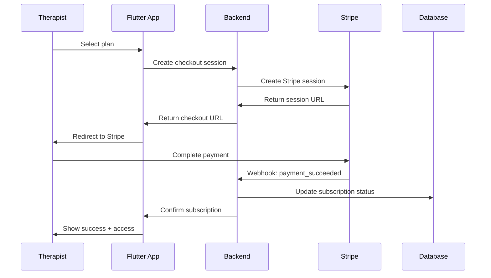

# Monetization & Subscription Strategy
## MoodBoard Pro - Revenue Model & Pricing

**Version:** 1.0  
**Date:** May 16, 2026

---

## 1. Pricing Strategy

### 1.1 Subscription Tiers

| Tier | Price/Month | Client Limit | Features | Target Audience |
|------|-------------|--------------|----------|-----------------|
| **Starter** | $29.99 | Up to 10 clients | Basic mood tracking, Visual moodboards, Weekly AI insights, Email support | Solo practitioners, New therapists |
| **Professional** | $59.99 | Up to 30 clients | Everything in Starter, Daily AI insights, Advanced analytics, Priority support, Custom branding | Established therapists |
| **Practice** | $149.99 | Up to 100 clients | Everything in Professional, Multi-therapist accounts, Team collaboration, API access, Dedicated support | Group practices, Clinics |
| **Enterprise** | Custom | Unlimited | Everything in Practice, White-label options, Custom integrations, SLA guarantees, Account manager | Large organizations |

### 1.2 Pricing Rationale

**$29.99 Base Price Justification:**
- **Market Research:** Competitors charge $20-$50/month for practice management
- **Value Proposition:** Unique visual mood tracking + AI insights
- **Cost Structure:** ~$5-8 per therapist in infrastructure costs
- **Profit Margin:** 70-80% gross margin
- **Psychological Pricing:** Under $30 threshold for easy approval

**Tiered Approach Benefits:**
- Captures different market segments
- Natural upgrade path
- Higher LTV through upsells
- Predictable revenue scaling

---

## 2. Revenue Projections

### 2.1 Path to $10k MRR

**Conservative Scenario (18 months):**

| Month | Starter | Professional | Practice | Total Therapists | MRR | Cumulative |
|-------|---------|--------------|----------|------------------|-----|------------|
| 1-3 | 20 | 5 | 0 | 25 | $900 | $2,700 |
| 4-6 | 50 | 15 | 2 | 67 | $2,700 | $10,800 |
| 7-9 | 100 | 40 | 5 | 145 | $5,750 | $28,050 |
| 10-12 | 180 | 80 | 10 | 270 | $10,900 | $60,750 |
| 13-15 | 220 | 100 | 15 | 335 | $13,850 | $102,300 |
| 16-18 | 250 | 120 | 20 | 390 | $16,700 | $153,000 |

**Aggressive Scenario (12 months):**

| Month | Starter | Professional | Practice | Total Therapists | MRR | Cumulative |
|-------|---------|--------------|----------|------------------|-----|------------|
| 1-3 | 40 | 10 | 1 | 51 | $2,050 | $6,150 |
| 4-6 | 100 | 30 | 5 | 135 | $5,550 | $23,100 |
| 7-9 | 180 | 70 | 12 | 262 | $11,000 | $56,100 |
| 10-12 | 250 | 100 | 20 | 370 | $16,000 | $104,100 |

**Key Assumptions:**
- 5% monthly churn rate
- 30% conversion from free trial
- 20% upgrade rate annually
- Average customer acquisition cost: $150
- Payback period: 5-6 months

### 2.2 Revenue Breakdown by Source

**Primary Revenue (95%):**
- Subscription fees: $10,000/month at target

**Secondary Revenue (5%):**
- Add-on features: $300/month
- Professional services: $200/month
  - Custom onboarding
  - Training sessions
  - Data migration

**Total Target MRR:** $10,500

---

## 3. Stripe Integration Architecture

### 3.1 Subscription Flow



### 3.2 Stripe Products & Prices

**Product Setup:**
```javascript
// Stripe Product Configuration
{
  "starter": {
    "product_id": "prod_starter",
    "price_id": "price_starter_monthly",
    "amount": 2999, // $29.99
    "currency": "usd",
    "interval": "month",
    "metadata": {
      "client_limit": 10,
      "ai_insights": "weekly",
      "support_level": "email"
    }
  },
  "professional": {
    "product_id": "prod_professional",
    "price_id": "price_professional_monthly",
    "amount": 5999,
    "currency": "usd",
    "interval": "month",
    "metadata": {
      "client_limit": 30,
      "ai_insights": "daily",
      "support_level": "priority"
    }
  },
  "practice": {
    "product_id": "prod_practice",
    "price_id": "price_practice_monthly",
    "amount": 14999,
    "currency": "usd",
    "interval": "month",
    "metadata": {
      "client_limit": 100,
      "ai_insights": "realtime",
      "support_level": "dedicated"
    }
  }
}
```

### 3.3 Webhook Handling

**Critical Webhooks:**
1. `customer.subscription.created` - New subscription
2. `customer.subscription.updated` - Plan change
3. `customer.subscription.deleted` - Cancellation
4. `invoice.payment_succeeded` - Successful payment
5. `invoice.payment_failed` - Failed payment

**Webhook Processing:**
```dart
// Firebase Cloud Function
exports.stripeWebhook = functions.https.onRequest(async (req, res) => {
  const sig = req.headers['stripe-signature'];
  const event = stripe.webhooks.constructEvent(req.rawBody, sig, webhookSecret);
  
  switch (event.type) {
    case 'customer.subscription.created':
      await handleSubscriptionCreated(event.data.object);
      break;
    case 'invoice.payment_failed':
      await handlePaymentFailed(event.data.object);
      break;
    // ... other cases
  }
  
  res.json({received: true});
});
```

### 3.4 Subscription Management Features

**User-Facing:**
- View current plan
- Upgrade/downgrade
- Update payment method
- View billing history
- Cancel subscription
- Reactivate subscription

**Admin-Facing:**
- Manual subscription adjustments
- Refund processing
- Usage monitoring
- Churn analysis

---

## 4. Free Trial Strategy

### 4.1 Trial Configuration

**Trial Details:**
- **Duration:** 14 days
- **Credit Card:** Required (reduces fraud)
- **Access:** Full Professional tier features
- **Limit:** 5 clients during trial
- **Conversion Goal:** 30% trial-to-paid

### 4.2 Trial Optimization

**Onboarding Sequence:**
- Day 0: Welcome email + quick start guide
- Day 3: Feature highlight email
- Day 7: Check-in email + offer help
- Day 10: Upgrade reminder (4 days left)
- Day 13: Final reminder (24 hours)
- Day 15: Trial ended, prompt to subscribe

**In-App Prompts:**
- Progress bar showing trial days remaining
- Feature unlocks to demonstrate value
- Success stories from other therapists
- ROI calculator

---

## 5. Pricing Experiments & Optimization

### 5.1 A/B Testing Plan

**Test 1: Price Points (Months 1-3)**
- Variant A: $29.99 (control)
- Variant B: $24.99
- Variant C: $34.99
- **Metric:** Conversion rate + LTV

**Test 2: Trial Duration (Months 4-6)**
- Variant A: 14 days (control)
- Variant B: 7 days
- Variant C: 21 days
- **Metric:** Trial-to-paid conversion

**Test 3: Tier Structure (Months 7-9)**
- Variant A: 3 tiers (control)
- Variant B: 4 tiers (add $19.99 tier)
- Variant C: 2 tiers (simplify)
- **Metric:** Revenue per user

### 5.2 Dynamic Pricing Considerations

**Future Enhancements:**
- Geographic pricing (PPP adjustments)
- Volume discounts for practices
- Annual billing discount (2 months free)
- Referral credits
- Non-profit discounts

---

## 6. Payment Processing

### 6.1 Supported Payment Methods

**Primary:**
- Credit/Debit cards (Visa, Mastercard, Amex)
- ACH Direct Debit (US)
- SEPA Direct Debit (EU)

**Future:**
- PayPal
- Apple Pay / Google Pay
- Wire transfer (Enterprise)

### 6.2 Failed Payment Handling

**Dunning Process:**
1. **Day 0:** Payment fails, retry immediately
2. **Day 3:** Retry + email notification
3. **Day 7:** Final retry + in-app notification
4. **Day 10:** Subscription suspended
5. **Day 30:** Subscription cancelled

**Recovery Tactics:**
- Update payment method prompts
- Alternative payment options
- Pause subscription option
- Win-back offers

---

## 7. Revenue Operations

### 7.1 Key Metrics Dashboard

**Subscription Metrics:**
- MRR (Monthly Recurring Revenue)
- ARR (Annual Recurring Revenue)
- ARPU (Average Revenue Per User)
- LTV (Lifetime Value)
- CAC (Customer Acquisition Cost)
- LTV:CAC Ratio (target: 3:1)

**Growth Metrics:**
- New subscriptions
- Upgrades
- Downgrades
- Churn rate
- Net revenue retention

**Financial Metrics:**
- Gross margin
- Payment success rate
- Refund rate
- Revenue by tier

### 7.2 Reporting & Analytics

**Monthly Reports:**
- Revenue summary
- Cohort analysis
- Churn analysis
- Upgrade/downgrade trends
- Payment health

**Tools:**
- Stripe Dashboard
- Custom analytics (Mixpanel)
- Financial reporting (QuickBooks integration)

---

## 8. Compliance & Legal

### 8.1 Billing Compliance

**Requirements:**
- PCI DSS compliance (handled by Stripe)
- Sales tax collection (Stripe Tax)
- VAT handling (EU)
- Invoice generation
- Receipt delivery

### 8.2 Terms & Policies

**Required Documents:**
- Terms of Service
- Privacy Policy
- Refund Policy
- Subscription Agreement
- HIPAA Business Associate Agreement

**Refund Policy:**
- 30-day money-back guarantee
- Pro-rated refunds for annual plans
- No refunds for partial months
- Cancellation anytime

---

## 9. Customer Success & Retention

### 9.1 Onboarding Program

**Goals:**
- 80% activation rate (first mood entry)
- 90% completion of setup wizard
- 50% invite at least one client

**Onboarding Checklist:**
- [ ] Complete profile
- [ ] Invite first client
- [ ] Create first mood entry (as demo)
- [ ] Review analytics dashboard
- [ ] Set up notifications

### 9.2 Retention Strategies

**Engagement Tactics:**
- Weekly usage reports
- Monthly insights emails
- Feature announcements
- Educational content
- Community building

**Churn Prevention:**
- At-risk user identification
- Proactive outreach
- Feature adoption campaigns
- Feedback collection
- Win-back campaigns

---

## 10. Scaling Considerations

### 10.1 Infrastructure Costs

**Current Costs (per therapist/month):**
- Firebase: $2-3
- AI API: $3-5
- Stripe fees: $0.90 (3% of $29.99)
- Other services: $0.50
- **Total:** ~$6.40-9.40

**Gross Margin:** 68-79%

### 10.2 Cost Optimization

**Strategies:**
- AI response caching
- Batch processing
- Reserved capacity (at scale)
- CDN optimization
- Database query optimization

**Break-even Analysis:**
- Fixed costs: $5,000/month (team, tools)
- Variable costs: $8/therapist
- Break-even: 227 therapists at $29.99

---

## 11. Competitive Pricing Analysis

### 11.1 Market Comparison

| Competitor | Price | Focus | Strengths | Weaknesses |
|------------|-------|-------|-----------|------------|
| SimplePractice | $29-99/mo | Practice mgmt | Comprehensive | Not mood-focused |
| TherapyNotes | $49-99/mo | EHR + billing | HIPAA compliant | Complex, expensive |
| Moodpath | Free-$6.99/mo | B2C mood tracking | Simple, affordable | Not for therapists |
| Daylio | Free-$4.99/mo | Personal journaling | Easy to use | No therapist features |
| **MoodBoard Pro** | $29.99-149.99/mo | Therapist-client mood | Visual + AI | New to market |

**Competitive Advantages:**
- Only visual-first mood tracking for therapists
- AI-powered insights
- Therapist-client collaboration
- Competitive pricing
- Modern tech stack

---

## 12. Action Items

### 12.1 Pre-Launch (Months 1-2)

- [ ] Set up Stripe account
- [ ] Create products and prices
- [ ] Implement subscription flow
- [ ] Set up webhook handling
- [ ] Create billing portal
- [ ] Write terms and policies
- [ ] Design pricing page
- [ ] Set up analytics tracking

### 12.2 Launch (Month 3)

- [ ] Enable free trials
- [ ] Launch with Starter tier only
- [ ] Monitor conversion rates
- [ ] Collect user feedback
- [ ] Iterate on pricing

### 12.3 Post-Launch (Months 4-6)

- [ ] Introduce Professional tier
- [ ] Start A/B testing
- [ ] Implement upgrade prompts
- [ ] Launch referral program
- [ ] Add annual billing option

---

**Document Control:**
- **Author:** Bob (AI Planning Assistant)
- **Next Review:** After first 100 customers
- **Version History:**
  - v1.0 (2026-05-16): Initial strategy