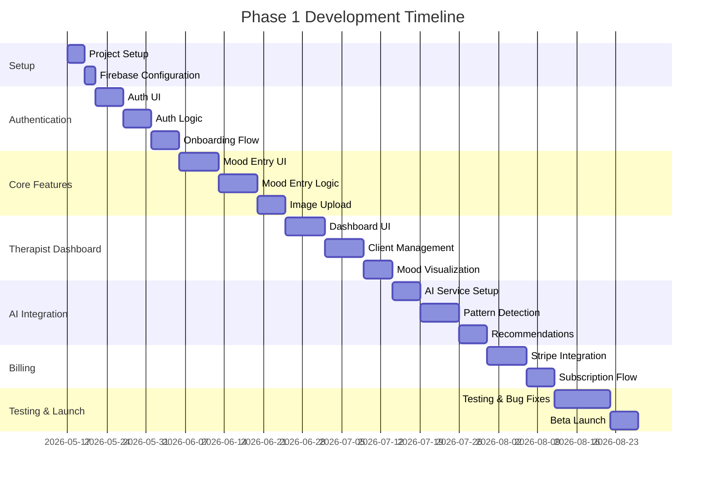

# MVP Development Plan
## MoodBoard Pro - Phased Implementation Strategy

**Version:** 1.0  
**Date:** May 16, 2026

---

## 1. MVP Philosophy

### 1.1 Core Principle
Build the **minimum viable product** that delivers core value: enabling therapists to track client moods visually and gain AI-powered insights.

### 1.2 Success Criteria
- **User Validation:** 50 therapists actively using the platform
- **Engagement:** 70% weekly active users
- **Retention:** 80% month-over-month retention
- **Feedback:** NPS score > 40
- **Technical:** 99.5% uptime, < 2s page load

---

## 2. MVP Feature Set

### 2.1 Phase 1: Core MVP (Months 1-3)

**Must-Have Features:**

**Authentication & Onboarding:**
- ✅ Email/password registration
- ✅ Role selection (Therapist/Client)
- ✅ Basic profile setup
- ✅ HIPAA consent flow
- ✅ Guided onboarding wizard

**Therapist Features:**
- ✅ Dashboard with client overview
- ✅ Invite clients via email
- ✅ View client mood entries
- ✅ Basic mood trend chart
- ✅ Client list with search
- ✅ Subscription management (Starter tier only)

**Client Features:**
- ✅ Create mood entry
  - Mood score slider (1-10)
  - Add up to 5 images
  - Select emotions (max 5)
  - Add text notes (max 500 chars)
- ✅ View mood history (list view)
- ✅ Share entry with therapist
- ✅ Basic profile settings

**AI Features (Limited):**
- ✅ Weekly mood summary
- ✅ Basic pattern detection (3 patterns max)
- ✅ Simple recommendations (text only)

**Technical Infrastructure:**
- ✅ Firebase Authentication
- ✅ Firestore database
- ✅ Firebase Storage for images
- ✅ Basic error handling
- ✅ Crashlytics integration

**Nice-to-Have (Defer to Phase 2):**
- ❌ Color palette selection
- ❌ Drawing canvas
- ❌ Quote snippets
- ❌ Advanced analytics
- ❌ In-app messaging
- ❌ Push notifications
- ❌ Multiple subscription tiers

### 2.2 Phase 2: Enhanced Features (Months 4-6)

**New Features:**
- ✅ Professional subscription tier
- ✅ Advanced analytics dashboard
- ✅ Daily AI insights
- ✅ Color palette selection
- ✅ Quote snippets
- ✅ Push notifications
- ✅ In-app messaging (basic)
- ✅ Export reports (PDF)
- ✅ Calendar view for mood entries
- ✅ Mood entry templates
- ✅ Dark mode

**Improvements:**
- ✅ Enhanced onboarding
- ✅ Better error handling
- ✅ Performance optimization
- ✅ Offline support (basic)

### 2.3 Phase 3: Scale & Polish (Months 7-12)

**New Features:**
- ✅ Practice subscription tier
- ✅ Multi-therapist accounts
- ✅ Drawing canvas
- ✅ Advanced AI recommendations
- ✅ Wearable integration (basic)
- ✅ API access (beta)
- ✅ White-label options (Enterprise)
- ✅ Video session integration
- ✅ Group therapy support

**Improvements:**
- ✅ Full offline support
- ✅ Advanced caching
- ✅ Performance optimization
- ✅ Accessibility improvements
- ✅ Internationalization (Spanish, French)

---

## 3. Development Phases

### 3.1 Phase 1: Foundation (Weeks 1-12)



**Week-by-Week Breakdown:**

**Weeks 1-2: Project Setup**
- Initialize Flutter project
- Set up Firebase project
- Configure development environment
- Create project structure
- Set up CI/CD pipeline
- Design system implementation

**Weeks 3-4: Authentication**
- Email/password authentication
- Role-based access control
- Profile creation
- Onboarding wizard
- HIPAA consent flow

**Weeks 5-6: Client Mood Entry**
- Mood score slider
- Emotion selection
- Image upload
- Text notes
- Save/edit functionality

**Weeks 7-8: Therapist Dashboard**
- Dashboard layout
- Client list
- Client invitation
- Mood trend visualization
- Client detail view

**Weeks 9-10: AI Integration**
- OpenAI API integration
- Pattern detection algorithm
- Recommendation generation
- Insight display

**Weeks 11-12: Billing & Launch**
- Stripe integration
- Subscription flow
- Testing
- Beta launch

### 3.2 Phase 2: Enhancement (Weeks 13-24)

**Focus Areas:**
1. **Advanced Features** (Weeks 13-16)
   - Professional tier
   - Advanced analytics
   - Color palettes
   - Quote snippets

2. **User Experience** (Weeks 17-20)
   - Push notifications
   - In-app messaging
   - Calendar view
   - Templates

3. **Polish & Optimization** (Weeks 21-24)
   - Performance optimization
   - Bug fixes
   - User feedback implementation
   - Marketing preparation

### 3.3 Phase 3: Scale (Months 7-12)

**Focus Areas:**
1. **Enterprise Features** (Months 7-8)
   - Practice tier
   - Multi-therapist support
   - API access
   - White-label options

2. **Advanced Capabilities** (Months 9-10)
   - Drawing canvas
   - Wearable integration
   - Video integration
   - Group therapy

3. **Global Expansion** (Months 11-12)
   - Internationalization
   - Regional compliance
   - Performance optimization
   - Marketing scale-up

---

## 4. Technical Implementation Details

### 4.1 Project Structure

```
moodboard_pro/
├── lib/
│   ├── core/
│   │   ├── constants/
│   │   ├── theme/
│   │   ├── utils/
│   │   └── errors/
│   ├── data/
│   │   ├── models/
│   │   ├── repositories/
│   │   └── datasources/
│   ├── domain/
│   │   ├── entities/
│   │   ├── repositories/
│   │   └── usecases/
│   ├── presentation/
│   │   ├── providers/
│   │   ├── screens/
│   │   │   ├── auth/
│   │   │   ├── onboarding/
│   │   │   ├── therapist/
│   │   │   └── client/
│   │   ├── widgets/
│   │   └── routes/
│   └── main.dart
├── test/
├── assets/
├── pubspec.yaml
└── README.md
```

### 4.2 Key Dependencies (Phase 1)

```yaml
dependencies:
  flutter:
    sdk: flutter
  
  # State Management
  flutter_riverpod: ^2.4.0
  riverpod_annotation: ^2.3.0
  
  # Navigation
  go_router: ^13.0.0
  
  # Firebase
  firebase_core: ^2.24.0
  firebase_auth: ^4.16.0
  cloud_firestore: ^4.14.0
  firebase_storage: ^11.6.0
  firebase_analytics: ^10.8.0
  firebase_crashlytics: ^3.4.0
  
  # UI
  flutter_svg: ^2.0.9
  cached_network_image: ^3.3.0
  fl_chart: ^0.66.0
  shimmer: ^3.0.0
  
  # Functionality
  image_picker: ^1.0.7
  image_cropper: ^5.0.1
  share_plus: ^7.2.1
  
  # HTTP & API
  dio: ^5.4.0
  retrofit: ^4.0.3
  
  # Payments
  flutter_stripe: ^10.1.0
  
  # Utilities
  intl: ^0.18.1
  uuid: ^4.3.3
  
dev_dependencies:
  flutter_test:
    sdk: flutter
  flutter_lints: ^3.0.0
  build_runner: ^2.4.0
  riverpod_generator: ^2.3.0
  mockito: ^5.4.0
```

### 4.3 Firebase Collections (Phase 1)

**Minimal Schema:**

```
users/
  {userId}/
    - email: string
    - role: string (therapist|client)
    - createdAt: timestamp

therapists/
  {therapistId}/
    - userId: string (ref)
    - name: string
    - email: string
    - subscriptionTier: string
    - clientCount: number
    - stripeCustomerId: string

clients/
  {clientId}/
    - userId: string (ref)
    - therapistId: string (ref)
    - name: string
    - email: string
    - inviteStatus: string
    - consentGiven: boolean

moodEntries/
  {entryId}/
    - clientId: string (ref)
    - timestamp: timestamp
    - moodScore: number (1-10)
    - emotions: array
    - imageUrls: array
    - notes: string
    - isShared: boolean

aiInsights/
  {insightId}/
    - clientId: string (ref)
    - type: string (pattern|recommendation)
    - content: string
    - generatedAt: timestamp
    - confidence: number
```

---

## 5. Testing Strategy

### 5.1 Phase 1 Testing

**Unit Tests:**
- Business logic (60% coverage minimum)
- Utilities and helpers
- Data models
- Validators

**Integration Tests:**
- Authentication flow
- Mood entry creation
- Image upload
- Data synchronization

**E2E Tests:**
- User registration
- Therapist invites client
- Client creates mood entry
- Therapist views mood entry

**Manual Testing:**
- UI/UX testing
- Cross-device testing
- Performance testing
- Security testing

### 5.2 Testing Tools

- `flutter_test` - Unit testing
- `mockito` - Mocking
- `integration_test` - E2E testing
- `golden_toolkit` - UI testing
- Firebase Emulator Suite - Local testing

---

## 6. Launch Strategy

### 6.1 Beta Launch (Week 12)

**Target:**
- 20-30 beta testers
- Mix of therapists and clients
- Active feedback collection

**Channels:**
- Personal network
- Therapist communities
- Reddit (r/therapists)
- LinkedIn outreach

**Success Metrics:**
- 80% completion of onboarding
- 50% create first mood entry
- 70% weekly active users
- Collect 20+ feedback responses

### 6.2 Public Launch (Month 4)

**Preparation:**
- Website landing page
- Marketing materials
- App Store optimization
- Press kit
- Launch announcement

**Channels:**
- Product Hunt launch
- Social media campaign
- Therapist associations
- Mental health conferences
- Content marketing (blog)

**Goals:**
- 100 sign-ups in first week
- 50 paying customers in first month
- Media coverage (3+ publications)

---

## 7. Risk Mitigation

### 7.1 Technical Risks

| Risk | Mitigation |
|------|------------|
| Firebase scaling issues | Monitor usage, plan migration path |
| AI API costs too high | Implement caching, rate limiting |
| Image storage costs | Compress images, set limits |
| App store rejection | Follow guidelines, thorough testing |
| Security vulnerabilities | Regular audits, penetration testing |

### 7.2 Product Risks

| Risk | Mitigation |
|------|------------|
| Low user adoption | Strong onboarding, user research |
| High churn rate | Engagement features, customer success |
| Feature creep | Strict MVP scope, prioritization |
| Poor user feedback | Regular user interviews, surveys |
| Competitor launch | Fast iteration, unique features |

---

## 8. Success Metrics by Phase

### 8.1 Phase 1 Metrics (Months 1-3)

**User Acquisition:**
- 50 therapist sign-ups
- 150 client accounts
- 30 paying therapists

**Engagement:**
- 70% weekly active users
- 3+ mood entries per client per week
- 5+ therapist logins per week

**Technical:**
- 99.5% uptime
- < 2s page load time
- < 1% crash rate

**Financial:**
- $900 MRR
- $150 CAC
- 6-month payback period

### 8.2 Phase 2 Metrics (Months 4-6)

**User Acquisition:**
- 150 therapist sign-ups
- 500 client accounts
- 100 paying therapists

**Engagement:**
- 75% weekly active users
- 4+ mood entries per client per week
- 80% feature adoption

**Financial:**
- $4,000 MRR
- $120 CAC
- 5-month payback period

### 8.3 Phase 3 Metrics (Months 7-12)

**User Acquisition:**
- 400 therapist sign-ups
- 1,500 client accounts
- 300 paying therapists

**Engagement:**
- 80% weekly active users
- 5+ mood entries per client per week
- 90% feature adoption

**Financial:**
- $12,000 MRR
- $100 CAC
- 4-month payback period

---

## 9. Resource Requirements

### 9.1 Team Composition

**Phase 1 (Months 1-3):**
- 1 Flutter Developer (Full-time)
- 1 Backend Developer (Part-time, 20hrs/week)
- 1 UI/UX Designer (Part-time, 15hrs/week)
- 1 Product Manager (Part-time, 10hrs/week)

**Phase 2 (Months 4-6):**
- 2 Flutter Developers (Full-time)
- 1 Backend Developer (Full-time)
- 1 UI/UX Designer (Part-time, 20hrs/week)
- 1 Product Manager (Part-time, 15hrs/week)
- 1 QA Engineer (Part-time, 15hrs/week)

**Phase 3 (Months 7-12):**
- 3 Flutter Developers (Full-time)
- 1 Backend Developer (Full-time)
- 1 UI/UX Designer (Full-time)
- 1 Product Manager (Full-time)
- 1 QA Engineer (Full-time)
- 1 Customer Success Manager (Part-time, 20hrs/week)

### 9.2 Infrastructure Costs

**Phase 1 (Monthly):**
- Firebase: $100-200
- OpenAI API: $200-300
- Stripe: $50
- Other services: $100
- **Total:** ~$450-650/month

**Phase 2 (Monthly):**
- Firebase: $300-500
- OpenAI API: $500-800
- Stripe: $150
- Other services: $200
- **Total:** ~$1,150-1,650/month

**Phase 3 (Monthly):**
- Firebase: $800-1,200
- OpenAI API: $1,500-2,000
- Stripe: $400
- Other services: $500
- **Total:** ~$3,200-4,100/month

---

## 10. Decision Framework

### 10.1 Feature Prioritization Matrix

**Criteria:**
1. **User Value:** How much does this help users?
2. **Business Impact:** Does this drive revenue/retention?
3. **Technical Complexity:** How hard is it to build?
4. **Strategic Fit:** Aligns with vision?

**Scoring:**
- High: 3 points
- Medium: 2 points
- Low: 1 point

**Priority Formula:**
```
Priority Score = (User Value + Business Impact) / Technical Complexity
```

**Example:**
- Drawing Canvas: (3 + 2) / 3 = 1.67 (Medium Priority)
- Mood Entry: (3 + 3) / 2 = 3.0 (High Priority)
- Dark Mode: (2 + 1) / 1 = 3.0 (High Priority)

### 10.2 Go/No-Go Criteria

**Before Phase 2:**
- ✅ 30+ paying customers
- ✅ 70% weekly active users
- ✅ NPS > 40
- ✅ < 10% monthly churn
- ✅ 99% uptime

**Before Phase 3:**
- ✅ 100+ paying customers
- ✅ $4,000+ MRR
- ✅ 75% weekly active users
- ✅ NPS > 50
- ✅ < 8% monthly churn

---

## 11. Pivot Triggers

### 11.1 When to Pivot

**Red Flags:**
- < 20% trial-to-paid conversion after 3 months
- > 15% monthly churn consistently
- NPS < 20 after 6 months
- Unable to acquire users at < $200 CAC
- Negative user feedback on core value prop

**Pivot Options:**
1. **Target Market:** Switch from therapists to coaches/counselors
2. **Business Model:** B2C instead of B2B
3. **Core Feature:** Focus on analytics instead of mood tracking
4. **Platform:** Web-only instead of mobile-first

---

## 12. Next Steps

### 12.1 Immediate Actions (Week 1)

- [ ] Set up GitHub repository
- [ ] Initialize Flutter project
- [ ] Create Firebase project
- [ ] Set up development environment
- [ ] Create project board (Jira/Linear)
- [ ] Schedule daily standups
- [ ] Create design mockups in Figma
- [ ] Write technical specifications

### 12.2 Week 2 Actions

- [ ] Implement authentication UI
- [ ] Set up Firebase Auth
- [ ] Create user models
- [ ] Implement role-based routing
- [ ] Set up error handling
- [ ] Configure Crashlytics

---

**Document Control:**
- **Author:** Bob (AI Planning Assistant)
- **Review Frequency:** Bi-weekly
- **Next Review:** After Phase 1 completion
- **Version History:**
  - v1.0 (2026-05-16): Initial MVP plan