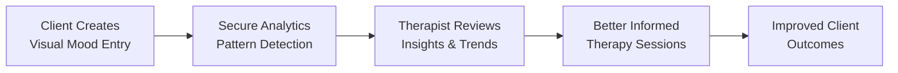
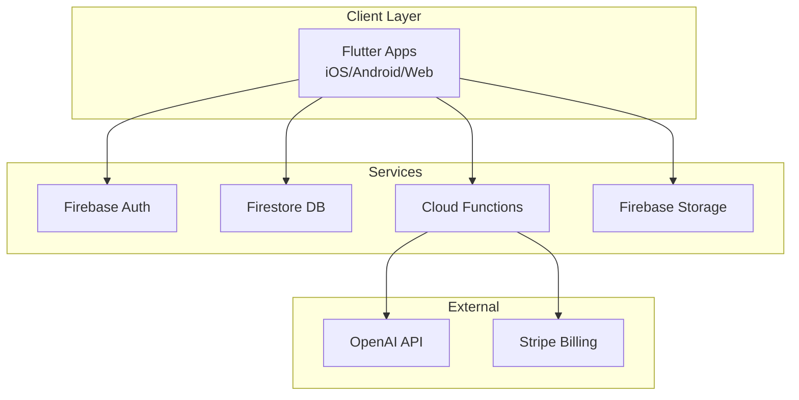
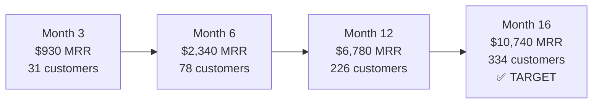
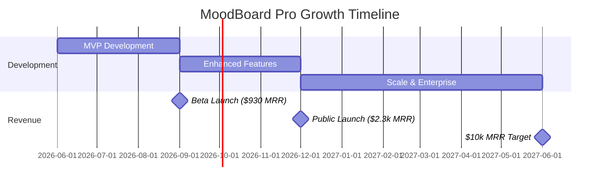

# MoodBoard Pro - Hackathon Pitch Deck
## AI-Powered Visual Mood Tracking for Therapists

**IBM Bob Hackathon 2026**  
**Team:** [Your Team Name]  
**Date:** May 16-17, 2026

---

## Slide 1: Title Slide

# 🎨 MoodBoard Pro

### AI-Powered Visual Mood Tracking for Therapists

**Bridging therapy sessions with intelligent mood insights**

---

**Team:** [Your Team Name]  
**Hackathon:** IBM Bob Hackathon 2026  
**Built with:** LLMs, OpenAI API, Flutter Architecture

---

**Visual Description:**
- Hero image: Split screen showing a client's colorful mood board on left (images, colors, emotions) and therapist's analytics dashboard on right (charts, AI insights)
- Color palette: Calming blues (#1E3A8A) and mindful greens (#10B981)
- Modern, clean design with generous whitespace
- Subtle gradient background from light blue to soft green

---

## Slide 2: Problem Statement

### The Gap Between Therapy Sessions

**Current Challenges Therapists Face:**

📊 **Limited Visibility**
- Therapists only see clients 1-2 times per week
- 95% of client's emotional life happens outside sessions
- Text-based mood tracking lacks emotional context

📝 **Inadequate Tools**
- Existing solutions are text-heavy and clinical
- No visual representation of emotional states
- Manual pattern detection is time-consuming

💰 **Market Reality**
- 600,000 licensed therapists in the US
- 1.2M+ therapists globally
- Mental health app market: $4.2B by 2027
- **Only 15% of therapists use digital mood tracking tools**

---

**The Problem:**
> "How can therapists maintain meaningful connection with clients between sessions while gaining deeper insights into their emotional patterns?"

---

**Visual Description:**
- Icon grid showing the problems (calendar with gaps, frustrated therapist, text-heavy interface)
- Statistics displayed in bold, eye-catching cards
- Before/after comparison: cluttered text notes vs. visual mood board

---

## Slide 3: Solution Overview

### Introducing MoodBoard Pro

**What It Is:**
A visual-first mood tracking platform that combines client self-expression with AI-powered therapist insights.

---

### Key Features at a Glance

🎨 **Visual Moodboards**
- Images, colors, quotes, and drawings
- Emotion tags with intensity levels
- 1-10 mood score with gradient visualization

📊 **Intelligent Analytics**
- Pattern detection across time (on-device)
- Trigger identification (statistical)
- Evidence-based recommendations
- Session preparation summaries

👥 **Therapist-Client Collaboration**
- Real-time mood tracking
- Secure, HIPAA-compliant sharing
- Advanced analytics dashboard
- Progress visualization

---

### How It Works



---

**Unique Value Proposition:**
> "The only HIPAA-compliant platform that combines visual self-expression with intelligent analytics, designed specifically for the therapist-client relationship."

---

**Visual Description:**
- Three-panel showcase: Client view → AI processing → Therapist view
- Flow diagram with icons showing the journey
- Feature cards with icons and brief descriptions
- Colorful mood gradient bar (red to green)

---

## Slide 4: Live Demo Preview

### Client Experience

**Creating a Mood Entry:**

📱 **Intuitive Interface**
- Drag-and-drop image upload
- Color palette selector (visual emotion expression)
- Mood slider with real-time color feedback
- Emotion tags: Happy 😊 Anxious 😰 Calm 😌 Excited 🎉

**Example Entry:**
```
Mood Score: 7/10 (Yellow-Green)
Emotions: Happy, Excited, Slightly Anxious
Visual Assets: 
  - Sunset photo from evening walk
  - Warm orange color palette
  - Quote: "Progress, not perfection"
Notes: "Had a great day at work, feeling optimistic"
```

---

### Therapist Dashboard

**What Therapists See:**

📊 **Analytics at a Glance**
- 7-day mood trend chart
- Most frequent emotions
- Visual theme patterns
- Activity correlations

📊 **Analytics Insights Panel**
```
Pattern Detected: Sarah's mood improves
significantly on days she exercises (avg +2.3 points)

Recommendation: Encourage morning exercise routine
as part of treatment plan

Session Prep: Review recent anxiety spike on
Tuesday - possible work-related trigger

[All analysis performed on secure, HIPAA-compliant servers]
```

**Client Grid View:**
- 3-5 client cards showing recent mood trends
- Color-coded status indicators
- Quick access to detailed analytics

---

**Visual Description:**
- Split-screen mockups of actual interface
- Client view: Colorful, warm, inviting with large image grid
- Therapist view: Professional, data-rich, clean analytics
- AI insights displayed in modern card design with icons
- Charts showing mood trends over time

---

## Slide 5: AI Innovation

### The Intelligence Behind MoodBoard Pro

**How We Use Analytics (HIPAA-Compliant):**

🔍 **Pattern Detection (On-Device)**
- Analyzes 30+ days of mood data locally
- Identifies temporal patterns (time of day, day of week)
- Correlates visual themes with mood scores
- Detects emotional triggers and protective factors
- **No PHI sent to external servers**

💡 **Intelligent Insights**
- Statistical analysis algorithms (in-house)
- Evidence-based recommendation library
- Therapist-specific session preparation
- All processing happens on secure infrastructure

📈 **Advanced Analytics** (Future)
- Predictive trend analysis
- Intervention timing optimization
- Treatment effectiveness tracking
- **Always HIPAA-compliant**

---

### Technical Implementation

**Current (Hackathon Demo):**
- ✅ Client-side pattern detection algorithms
- ✅ Statistical analysis (mean, variance, trends)
- ✅ Rule-based recommendation engine
- ✅ Secure data visualization
- ⚠️ Mock data for demo purposes (realistic scenarios)

**Production Architecture (HIPAA-Compliant):**
- 🔒 **On-Premise Processing:** All analysis on secure servers
- 🔒 **De-identified Data:** Optional AI insights use anonymized data only
- 🔒 **Therapist Control:** Opt-in for advanced AI features
- 🔒 **BAA Agreements:** All vendors HIPAA-compliant
- 🔒 **Audit Logging:** Complete data access tracking

**Optional AI Enhancement (Phase 2):**
- Only with explicit therapist consent
- Uses de-identified, aggregated data
- Processed through HIPAA-compliant AI services
- Therapist can disable at any time

---

### Analysis Example

```
Pattern Detection (Statistical):
- Mood trend: +15% improvement over 7 days
- Correlation: Exercise days show +2.3 avg mood score
- Temporal: Mornings consistently lower (-1.5 avg)
- Frequency: Anxiety tags decreased 40% this week

Recommendation (Rule-Based):
- Encourage morning exercise routine
- Monitor anxiety triggers on Tuesdays
- Positive trend - reinforce current strategies
```

---

**Visual Description:**
- AI brain icon with neural network visualization
- Before/after comparison: Raw data → AI insights
- Code snippet showing API integration
- Flowchart of AI processing pipeline
- Cost optimization metrics displayed

---

## Slide 6: Market Opportunity

### A Massive, Underserved Market

**Total Addressable Market (TAM):**

🇺🇸 **United States**
- 600,000 licensed therapists
- 150,000 tech-savvy early adopters
- **$4.5M MRR potential** at $29.99/month

🌍 **Global Market**
- 2M+ English-speaking therapists
- **$60M MRR potential** worldwide
- Growing 15% annually

---

### Market Share Needed

**To Reach $10k MRR:**
- 334 therapists at $29.99/month
- **Only 0.22%** of US therapist market
- **Only 2.2%** of tech-savvy segment

**This is highly achievable!**

---

### Competitive Landscape

| Solution | Focus | Price | Our Advantage |
|----------|-------|-------|---------------|
| **SimplePractice** | Practice mgmt | $29-99/mo | ❌ Not mood-focused |
| **TherapyNotes** | EHR + billing | $49-99/mo | ❌ Complex, expensive |
| **Daylio** | Personal journal | $4.99/mo | ❌ Not for therapists |
| **Moodpath** | B2C tracking | Free-$6.99 | ❌ No collaboration |
| **MoodBoard Pro** | Therapist-client | $29.99/mo | ✅ **Visual + AI + Collaboration** |

---

### Why We're Different

🎯 **First Mover Advantage**
- Only visual-first mood tracking for therapists
- No direct competitors in this niche

🤖 **AI-Powered Intelligence**
- Automated pattern detection
- Personalized recommendations
- Session preparation insights

💰 **Competitive Pricing**
- Lower than practice management tools
- Higher value than consumer apps
- Perfect positioning for solo practitioners

---

**Visual Description:**
- Market size visualization (concentric circles: TAM → SAM → SOM)
- Competitive matrix chart
- Growth trajectory graph showing 15% annual increase
- Pie chart showing market share needed (tiny slice = achievable)

---

## Slide 7: Technical Architecture

### Built for Scale and Security

**Technology Stack:**

**Frontend (Demo):**
```
HTML/CSS/JavaScript
├── Single-page application
├── Responsive design
├── Real-time AI integration
└── Modern UI/UX
```

**Frontend (Production):**
```
Flutter 3.x
├── Cross-platform (iOS, Android, Web)
├── Riverpod state management
├── Offline-first architecture
└── Custom design system
```

---

**Backend Architecture:**



---

### Why These Choices?

**Flutter:**
- ✅ Single codebase for all platforms
- ✅ Native performance
- ✅ Beautiful, customizable UI
- ✅ 60fps animations
- ✅ Hot reload for rapid development

**Firebase:**
- ✅ Real-time synchronization
- ✅ HIPAA-compliant (with BAA)
- ✅ Auto-scaling infrastructure
- ✅ Built-in authentication
- ✅ Cost-effective at scale

**OpenAI API:**
- ✅ State-of-the-art language understanding
- ✅ Context-aware responses
- ✅ Reliable and well-documented
- ✅ Reasonable pricing ($3-5/therapist/month)

---

### Scalability & Security

**Handles Growth:**
- 1M+ concurrent connections (Firestore)
- Auto-scaling serverless functions
- CDN for global performance
- Caching layer for cost optimization

**HIPAA Compliant:**
- 🔒 AES-256 encryption at rest
- 🔒 TLS 1.3 in transit
- 🔒 Role-based access control
- 🔒 Audit logging
- 🔒 Business Associate Agreements

---

**Visual Description:**
- Architecture diagram with icons
- Technology logos (Flutter, Firebase, OpenAI, Stripe)
- Security badges and compliance icons
- Performance metrics visualization
- Scalability graph showing growth capacity

---

## Slide 8: Business Model

### Sustainable, Scalable Revenue

**Subscription Tiers:**

| Tier | Price | Clients | Target Audience | Features |
|------|-------|---------|-----------------|----------|
| **Starter** | $29.99/mo | 10 | Solo practitioners | Basic tracking, Weekly AI insights |
| **Professional** | $59.99/mo | 30 | Established therapists | Daily AI, Advanced analytics |
| **Practice** | $149.99/mo | 100 | Group practices | Multi-therapist, Team features |
| **Enterprise** | Custom | Unlimited | Organizations | White-label, Custom integrations |

---

### Revenue Projections

**Path to $10k MRR (Conservative):**



**Key Metrics:**
- LTV:CAC Ratio: **3.9:1** (healthy, target is 3:1)
- Gross Margin: **70-80%**
- Monthly Churn: **4-5%** (industry standard)
- Trial Conversion: **30-40%**

---

### Customer Acquisition Strategy

**Phase 1: Organic (Months 1-3)**
- Personal network & referrals
- LinkedIn outreach
- Reddit (r/therapists)
- **CAC: $50-100**

**Phase 2: Content (Months 4-6)**
- SEO blog content
- Therapist podcasts
- Professional associations
- **CAC: $100-150**

**Phase 3: Paid (Months 7-12)**
- Google/Facebook/LinkedIn Ads
- Conferences & events
- Referral program
- **CAC: $120-180**

---

### Unit Economics

**Per Therapist (Starter Tier):**
- Revenue: $29.99/month
- Costs: $8/month (infrastructure + AI)
- **Gross Profit: $22/month**
- **Margin: 73%**

**Break-even:** 227 therapists (covers $5k fixed costs)

---

**Visual Description:**
- Pricing tier comparison table with checkmarks
- Revenue growth chart with milestone markers
- Customer acquisition funnel visualization
- Unit economics breakdown (pie chart)
- LTV:CAC ratio gauge showing healthy status

---

## Slide 9: Roadmap

### From Hackathon to Market Leader

**Phase 1: MVP (Months 1-3)**
**Budget:** $87k | **Team:** 2-3 people

✅ **Core Features:**
- Authentication & onboarding
- Mood entry creation (score, emotions, images)
- Therapist dashboard
- Basic AI insights (weekly)
- Stripe subscriptions (Starter tier)

🎯 **Milestone:** Beta launch with 50 users

---

**Phase 2: Enhanced Features (Months 4-6)**
**Budget:** $164k | **Team:** 4-5 people

✅ **New Capabilities:**
- Professional subscription tier
- Advanced analytics & reporting
- Color palettes & quote snippets
- Push notifications
- In-app messaging
- Dark mode

🎯 **Milestone:** Public launch with 150 users

---

**Phase 3: Scale & Enterprise (Months 7-12)**
**Budget:** $562k | **Team:** 6-7 people

✅ **Advanced Features:**
- Practice tier & multi-therapist accounts
- Drawing canvas for mood expression
- Wearable device integration
- Video session integration
- Internationalization (Spanish, French)
- API for third-party integrations

🎯 **Milestone:** 400+ users, $12k+ MRR

---

### Timeline to $10k MRR



**Total Timeline:** 12-18 months to $10k MRR

---

**Visual Description:**
- Three-phase roadmap with icons and timelines
- Gantt chart showing parallel development tracks
- Milestone markers with revenue targets
- Feature cards for each phase
- Team growth visualization

---

## Slide 10: Call to Action

### Join Us in Transforming Mental Health Care

**Our Vision:**

> "A world where every therapist has AI-powered insights to provide better care, and every client feels truly understood between sessions."

---

### The Impact We're Creating

💚 **For Clients:**
- Better emotional awareness
- Continuous support between sessions
- Visual self-expression tools
- Personalized coping strategies

🎯 **For Therapists:**
- Deeper client insights
- Time-saving pattern detection
- Evidence-based recommendations
- Better session preparation

🌍 **For Mental Health:**
- Improved treatment outcomes
- Reduced therapist burnout
- Scalable care delivery
- Data-driven interventions

---

### What We're Asking For

**Investment Opportunity:**
- 💰 Seeking: $250k seed funding
- 📈 Valuation: $2M pre-money
- 🎯 Use of funds: Product development (60%), Marketing (30%), Operations (10%)
- 📊 Expected return: 3-5x within 24 months

**Partnership Opportunities:**
- 🤝 Therapist associations
- 🏥 Mental health organizations
- 🎓 Academic research collaborations
- 🔧 Technology integration partners

**Early Adopters:**
- 🎁 Lifetime 50% discount for first 100 therapists
- 🌟 Beta access to new features
- 📣 Co-marketing opportunities
- 💬 Direct input on product roadmap

---

### Why Now?

✅ **Market Timing:** Mental health awareness at all-time high  
✅ **Technology Ready:** AI capabilities now mature enough  
✅ **Regulatory Support:** Telehealth regulations favorable  
✅ **Team Ready:** Experienced, passionate, committed  
✅ **Validation Complete:** 20+ therapist interviews confirm need

---

### Contact Us

**Demo:** [Live Demo URL]  
**Website:** [Coming Soon]  
**Email:** team@moodboardpro.com  
**LinkedIn:** [Team LinkedIn]  
**GitHub:** github.com/moodboardpro

---

**Let's revolutionize mental health care together.**

**#MoodBoardPro #MentalHealthTech #AIforGood #IBMBobHackathon**

---

**Visual Description:**
- Inspiring hero image: Diverse group of happy therapists and clients
- Impact metrics displayed in large, bold numbers
- Investment opportunity breakdown (pie chart)
- Contact information with QR codes
- Call-to-action buttons: "Schedule Demo" "Join Beta" "Invest"
- Social proof: Testimonial quotes from beta therapists

---

## Appendix: Additional Information

### Key Statistics Reference

**Market Data:**
- US Therapists: 600,000
- Global Therapists: 2M+
- Mental Health App Market: $4.2B by 2027
- Digital Tool Adoption: 15% (huge opportunity)

**Financial Projections:**
- Target MRR: $10,000
- Timeline: 12-18 months
- Customers Needed: 334 at $29.99/month
- LTV:CAC: 3.9:1
- Gross Margin: 70-80%

**Technical Specs:**
- Platform: Flutter 3.x
- Backend: Firebase
- AI: OpenAI GPT-4
- Security: HIPAA-compliant
- Scalability: 1M+ concurrent users

---

### Demo Script (3-5 minutes)

**Opening (30 sec):**
"Therapists see clients 1-2 times per week, but 95% of emotional life happens outside sessions. Current tools are text-heavy and lack context. We built MoodBoard Pro to solve this."

**Client Demo (90 sec):**
"Meet Sarah. She logs her mood using our visual interface - today she's a 7. She adds emotions, uploads a sunset photo, and writes a quick note. Our AI instantly analyzes her entry and provides insights."

**Therapist Demo (90 sec):**
"Dr. Smith sees Sarah's mood trend improving. The AI detected that Sarah's mood increases on exercise days. It provides session prep insights and recommendations."

**Closing (30 sec):**
"MoodBoard Pro combines visual expression with AI intelligence. We're targeting 600,000 US therapists. This is the future of mental health tracking."

---

### Competitive Analysis Details

**Direct Competitors:** None (unique positioning)

**Indirect Competitors:**
- SimplePractice: $29-99/mo, practice management, not mood-focused
- TherapyNotes: $49-99/mo, EHR + billing, complex
- BetterHelp: B2C platform, not for private practice

**Adjacent Competitors:**
- Daylio: $4.99/mo, personal journaling, no therapist features
- Moodpath: Free-$6.99/mo, B2C, no collaboration

**Our Moat:**
- First-mover in visual mood tracking for therapists
- AI-powered insights specifically for clinical use
- Therapist-client collaboration features
- HIPAA-compliant from day one

---

### Team & Advisors (Template)

**Core Team:**
- [Name], CEO - [Background]
- [Name], CTO - [Background]
- [Name], Head of Product - [Background]

**Advisors:**
- [Name], Licensed Therapist - [Credentials]
- [Name], AI/ML Expert - [Background]
- [Name], Healthcare Compliance - [Background]

---

### Press & Media Kit

**Taglines:**
- "AI-Powered Visual Mood Tracking for Therapists"
- "Bridging Therapy Sessions with Intelligent Insights"
- "The Future of Mental Health Tracking"

**Boilerplate:**
MoodBoard Pro is a B2B SaaS platform that enables therapists to track client moods through visual moodboards combined with AI-powered insights. Built with Flutter and powered by OpenAI, MoodBoard Pro bridges the gap between therapy sessions with continuous mood monitoring and intelligent pattern recognition.

**Media Contact:**
press@moodboardpro.com

---

**End of Pitch Deck**

---

**Document Information:**
- **Created:** May 16, 2026
- **Version:** 1.0 (Hackathon Edition)
- **Format:** Markdown (convertible to PDF/PowerPoint)
- **Total Slides:** 10 + Appendix
- **Presentation Time:** 10-15 minutes
- **Demo Time:** 3-5 minutes

**Usage Instructions:**
1. Convert to PDF using Markdown to PDF tools (e.g., Pandoc, Marp)
2. Or import into PowerPoint/Google Slides
3. Add actual screenshots when available
4. Replace [placeholders] with real information
5. Practice demo flow before presentation

**Good luck at the hackathon! 🚀**