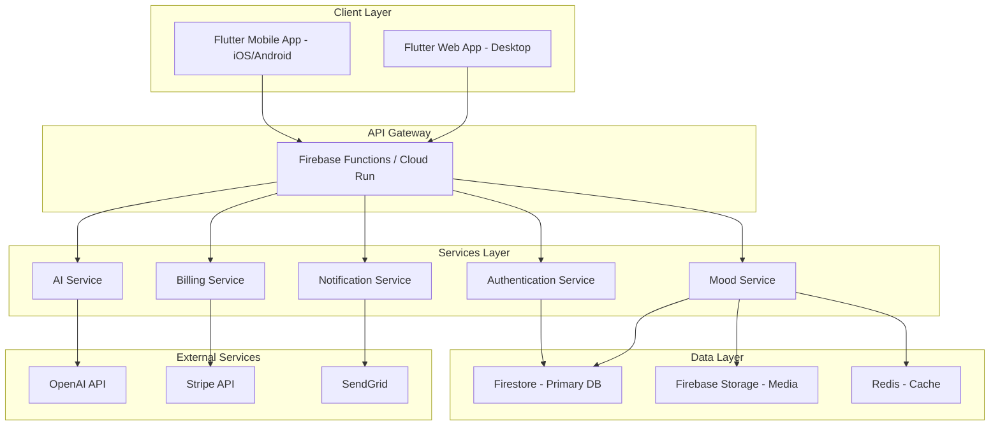
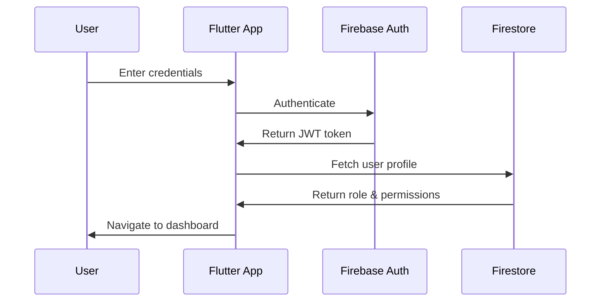
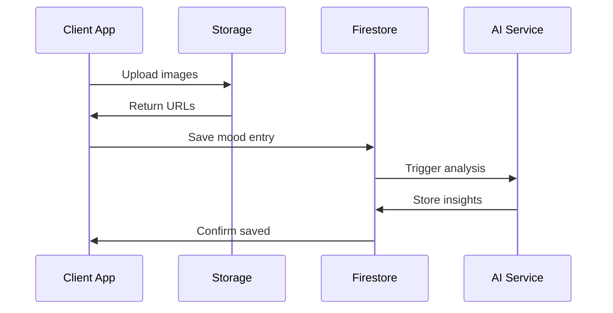
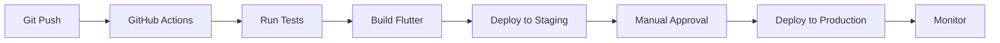

# Solution Design Document (SDD)
## MoodBoard Pro - Therapist-Client Mood Tracking Platform

**Version:** 1.0  
**Date:** May 16, 2026  
**Status:** Draft

---

## 1. Executive Summary

### 1.1 Project Overview
MoodBoard Pro is a B2B SaaS Flutter application that enables therapists and coaches to track client moods through visual moodboards combined with AI-powered insights. The platform bridges the gap between sessions by providing continuous mood monitoring and pattern recognition.

### 1.2 Business Objectives
- **Primary Goal:** Achieve $10k MRR within 12-18 months
- **Target Users:** 334+ paying therapists at $29.99/month
- **Market Position:** First visual-first mood tracking tool designed for therapist-client workflows

### 1.3 Success Metrics
- User Acquisition: 50 therapists in first 3 months
- Retention Rate: >85% monthly retention
- Client Engagement: 3+ mood entries per client per week
- NPS Score: >50

---

## 2. System Architecture

### 2.1 High-Level Architecture



### 2.2 Technology Stack

**Frontend:**
- Framework: Flutter 3.x
- State Management: Riverpod 2.x
- Navigation: go_router
- Local Storage: Hive / Drift
- UI Components: Custom design system

**Backend:**
- Primary: Firebase (Auth, Firestore, Functions, Storage)
- Alternative: Supabase (if self-hosted preferred)
- API: RESTful + Real-time subscriptions
- Serverless Functions: Cloud Functions (Node.js/Dart)

**AI/ML:**
- Primary: OpenAI GPT-4 API
- Fallback: Google Gemini API
- On-device: TensorFlow Lite for basic sentiment analysis

**Infrastructure:**
- Hosting: Firebase Hosting / Vercel
- CDN: Cloudflare
- Monitoring: Sentry + Firebase Crashlytics
- Analytics: Mixpanel + Firebase Analytics

**Payments:**
- Stripe Billing
- Webhook handling for subscription events

---

## 3. Detailed Component Design

### 3.1 Authentication & Authorization

**Authentication Flow:**


**Authorization Levels:**
- **Therapist Role:**
  - Full access to own clients
  - View aggregated mood data
  - Generate reports
  - Manage subscription
  
- **Client Role:**
  - Create mood entries
  - View own history
  - Share with therapist
  - Limited AI insights

**Security Measures:**
- HIPAA-compliant data handling
- End-to-end encryption for sensitive notes
- Row-level security in Firestore
- JWT token refresh strategy
- Multi-factor authentication (optional)

### 3.2 Mood Entry System

**Core Features:**
1. **Visual Moodboard Creation**
   - Image upload (max 10 per entry)
   - Color palette selection
   - Quote/text snippets
   - Drawing canvas
   - Emoji reactions

2. **Mood Scoring**
   - 1-10 scale slider
   - Multi-emotion tagging
   - Intensity levels
   - Context tags (work, family, health)

3. **Entry Management**
   - Draft saving
   - Edit history
   - Privacy controls
   - Sharing permissions

**Data Flow:**


### 3.3 AI Recommendation Engine

**Capabilities:**
1. **Pattern Detection**
   - Mood trend analysis
   - Trigger identification
   - Temporal patterns (time of day, day of week)
   - Correlation with visual themes

2. **Personalized Recommendations**
   - Coping strategies
   - Activity suggestions
   - Resource recommendations
   - Journaling prompts

3. **Therapist Insights**
   - Session preparation summaries
   - Risk flag detection
   - Progress tracking
   - Intervention suggestions

**AI Architecture:**
- **Input:** Last 30 days of mood entries + visual metadata
- **Processing:** GPT-4 with custom prompt engineering
- **Output:** Structured JSON with recommendations
- **Caching:** 24-hour cache for repeated queries
- **Cost Optimization:** Batch processing, token limits

### 3.4 Therapist Dashboard

**Key Features:**
1. **Client Overview**
   - Active clients list
   - Recent mood trends
   - Alert notifications
   - Quick actions

2. **Analytics & Reports**
   - Mood trend charts
   - Pattern visualizations
   - Comparative analysis
   - Exportable reports (PDF)

3. **Client Management**
   - Invite new clients
   - Set permissions
   - Session notes
   - Communication tools

### 3.5 Data Schema Design

**Firestore Collections:**

```
users/
  {userId}/
    - email
    - role
    - createdAt
    - lastLogin

therapists/
  {therapistId}/
    - userId (ref)
    - licenseNumber
    - specialization[]
    - subscriptionId (ref)
    - clientCount
    - settings{}

clients/
  {clientId}/
    - userId (ref)
    - therapistId (ref)
    - inviteStatus
    - consentGiven
    - onboardedAt

relationships/
  {relationshipId}/
    - therapistId (ref)
    - clientId (ref)
    - accessLevel
    - startDate
    - status

moodEntries/
  {entryId}/
    - clientId (ref)
    - timestamp
    - moodScore
    - emotions[]
    - visualAssets[]
    - notes (encrypted)
    - isShared
    - aiInsights{}

visualAssets/
  {assetId}/
    - entryId (ref)
    - type
    - storageUrl
    - metadata{}
    - uploadedAt

recommendations/
  {recommendationId}/
    - clientId (ref)
    - type
    - content
    - confidence
    - generatedAt
    - viewed

subscriptions/
  {subscriptionId}/
    - therapistId (ref)
    - stripeSubscriptionId
    - plan
    - status
    - currentPeriodEnd
    - clientLimit
```

**Indexes:**
- `moodEntries`: clientId + timestamp (DESC)
- `relationships`: therapistId + status
- `recommendations`: clientId + generatedAt (DESC)

---

## 4. Flutter Application Architecture

### 4.1 Project Structure

```
lib/
├── core/
│   ├── constants/
│   ├── theme/
│   ├── utils/
│   └── errors/
├── data/
│   ├── models/
│   ├── repositories/
│   └── datasources/
├── domain/
│   ├── entities/
│   ├── repositories/
│   └── usecases/
├── presentation/
│   ├── providers/
│   ├── screens/
│   ├── widgets/
│   └── routes/
└── main.dart
```

### 4.2 State Management Strategy

**Riverpod Architecture:**
- **Providers:** Business logic and state
- **StateNotifier:** Complex state management
- **FutureProvider:** Async data fetching
- **StreamProvider:** Real-time updates

**Example Provider Structure:**
```dart
// Mood entry provider
final moodEntriesProvider = StreamProvider.family<List<MoodEntry>, String>(
  (ref, clientId) {
    final repository = ref.watch(moodRepositoryProvider);
    return repository.watchMoodEntries(clientId);
  },
);

// AI recommendations provider
final recommendationsProvider = FutureProvider.family<List<Recommendation>, String>(
  (ref, clientId) async {
    final service = ref.watch(aiServiceProvider);
    return service.getRecommendations(clientId);
  },
);
```

### 4.3 Key Flutter Packages

**Essential:**
- `riverpod: ^2.4.0` - State management
- `go_router: ^13.0.0` - Navigation
- `firebase_core: ^2.24.0` - Firebase initialization
- `firebase_auth: ^4.16.0` - Authentication
- `cloud_firestore: ^4.14.0` - Database
- `firebase_storage: ^11.6.0` - File storage

**UI/UX:**
- `flutter_svg: ^2.0.9` - Vector graphics
- `cached_network_image: ^3.3.0` - Image caching
- `fl_chart: ^0.66.0` - Charts and graphs
- `shimmer: ^3.0.0` - Loading states
- `lottie: ^3.0.0` - Animations

**Functionality:**
- `image_picker: ^1.0.7` - Image selection
- `image_cropper: ^5.0.1` - Image editing
- `flutter_colorpicker: ^1.0.3` - Color selection
- `signature: ^5.4.0` - Drawing canvas
- `share_plus: ^7.2.1` - Sharing functionality

**AI/ML:**
- `google_generative_ai: ^0.2.0` - Gemini integration
- `http: ^1.2.0` - API calls
- `dio: ^5.4.0` - Advanced HTTP client

**Payments:**
- `flutter_stripe: ^10.1.0` - Stripe integration
- `in_app_purchase: ^3.1.13` - Mobile subscriptions

**Analytics:**
- `firebase_analytics: ^10.8.0` - Analytics
- `sentry_flutter: ^7.14.0` - Error tracking

---

## 5. Security & Compliance

### 5.1 HIPAA Compliance Measures

1. **Data Encryption**
   - At rest: Firestore encryption
   - In transit: TLS 1.3
   - Sensitive fields: AES-256 encryption

2. **Access Controls**
   - Role-based access control (RBAC)
   - Audit logging
   - Session management
   - Automatic logout

3. **Data Privacy**
   - Client consent management
   - Data retention policies
   - Right to deletion
   - Data export functionality

4. **Business Associate Agreement (BAA)**
   - Firebase BAA required
   - Stripe BAA for payments
   - Third-party vendor compliance

### 5.2 Security Best Practices

- Input validation and sanitization
- SQL injection prevention (Firestore queries)
- XSS protection
- CSRF tokens
- Rate limiting
- DDoS protection (Cloudflare)
- Regular security audits
- Penetration testing

---

## 6. Performance Optimization

### 6.1 Frontend Optimization

1. **Image Optimization**
   - Lazy loading
   - Progressive loading
   - WebP format
   - Thumbnail generation
   - CDN delivery

2. **State Management**
   - Selective rebuilds
   - Memoization
   - Pagination
   - Infinite scroll

3. **Caching Strategy**
   - Local database (Hive)
   - Image caching
   - API response caching
   - Offline-first approach

### 6.2 Backend Optimization

1. **Database**
   - Composite indexes
   - Query optimization
   - Denormalization where needed
   - Batch operations

2. **API**
   - Response compression
   - GraphQL for complex queries
   - Webhook optimization
   - Connection pooling

3. **AI Service**
   - Request batching
   - Response caching
   - Token optimization
   - Fallback strategies

---

## 7. Deployment Strategy

### 7.1 Environments

1. **Development**
   - Local Firebase emulators
   - Mock AI responses
   - Test Stripe keys

2. **Staging**
   - Firebase staging project
   - Real AI with limits
   - Stripe test mode

3. **Production**
   - Firebase production project
   - Full AI access
   - Stripe live mode

### 7.2 CI/CD Pipeline



**Tools:**
- GitHub Actions for CI/CD
- Fastlane for mobile deployment
- Firebase Hosting for web
- App Store Connect / Google Play Console

### 7.3 Monitoring & Alerting

**Metrics to Track:**
- App crashes (Crashlytics)
- API latency (Firebase Performance)
- Error rates (Sentry)
- User engagement (Analytics)
- Subscription metrics (Stripe)

**Alerts:**
- Critical errors
- High API costs
- Subscription failures
- Security incidents

---

## 8. Testing Strategy

### 8.1 Testing Pyramid

1. **Unit Tests (60%)**
   - Business logic
   - Utilities
   - Models
   - Validators

2. **Integration Tests (30%)**
   - API integration
   - Database operations
   - State management
   - Navigation flows

3. **E2E Tests (10%)**
   - Critical user journeys
   - Payment flows
   - Onboarding
   - Mood entry creation

### 8.2 Testing Tools

- `flutter_test` - Unit testing
- `mockito` - Mocking
- `integration_test` - E2E testing
- `golden_toolkit` - UI testing
- Postman - API testing

---

## 9. Scalability Considerations

### 9.1 Current Architecture Limits

- **Firestore:** 1M concurrent connections
- **Storage:** Unlimited with proper pricing
- **Functions:** Auto-scaling
- **AI API:** Rate limits apply

### 9.2 Scaling Strategy

**Phase 1 (0-1000 therapists):**
- Current architecture sufficient
- Firebase free tier + pay-as-you-go

**Phase 2 (1000-5000 therapists):**
- Implement caching layer (Redis)
- Optimize AI costs
- Consider reserved capacity

**Phase 3 (5000+ therapists):**
- Evaluate custom backend
- Dedicated infrastructure
- Multi-region deployment

---

## 10. Risk Assessment

### 10.1 Technical Risks

| Risk | Impact | Probability | Mitigation |
|------|--------|-------------|------------|
| AI API costs exceed budget | High | Medium | Implement caching, rate limiting, token optimization |
| Firebase scaling issues | High | Low | Monitor usage, plan migration path |
| HIPAA compliance gaps | Critical | Low | Legal review, security audit, BAA agreements |
| Mobile app rejection | Medium | Low | Follow guidelines, thorough testing |
| Data breach | Critical | Low | Security best practices, encryption, audits |

### 10.2 Business Risks

| Risk | Impact | Probability | Mitigation |
|------|--------|-------------|------------|
| Low therapist adoption | High | Medium | Strong marketing, free trial, referral program |
| High churn rate | High | Medium | Excellent onboarding, customer success team |
| Competitor entry | Medium | High | Fast iteration, unique features, strong brand |
| Regulatory changes | High | Low | Legal monitoring, compliance team |

---

## 11. Future Enhancements

### 11.1 Phase 2 Features (Months 6-12)

- Video session integration
- Group therapy support
- Advanced analytics dashboard
- White-label options
- API for third-party integrations

### 11.2 Phase 3 Features (Year 2)

- Mobile SDK for other apps
- Wearable device integration
- Predictive analytics
- Multi-language support
- Enterprise features (SSO, custom domains)

---

## 12. Appendices

### 12.1 Glossary

- **MRR:** Monthly Recurring Revenue
- **BAA:** Business Associate Agreement
- **HIPAA:** Health Insurance Portability and Accountability Act
- **DDD:** Domain-Driven Design
- **SDD:** Solution Design Document

### 12.2 References

- Flutter Documentation: https://flutter.dev
- Firebase Documentation: https://firebase.google.com/docs
- HIPAA Compliance Guide: https://www.hhs.gov/hipaa
- Stripe Documentation: https://stripe.com/docs

---

**Document Control:**
- **Author:** Bob (AI Planning Assistant)
- **Reviewers:** [To be assigned]
- **Next Review Date:** [To be scheduled]
- **Version History:**
  - v1.0 (2026-05-16): Initial draft