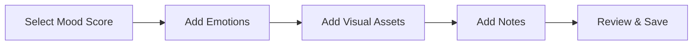

# UI/UX Design System & Wireframes
## MoodBoard Pro - Visual Design Specification

**Version:** 1.0  
**Date:** May 16, 2026

---

## 1. Design Philosophy

### 1.1 Core Principles

**Calm & Therapeutic:**
- Soft color palettes
- Generous whitespace
- Smooth animations
- Non-intrusive notifications

**Professional & Trustworthy:**
- Clean, modern interface
- Consistent branding
- HIPAA-compliant messaging
- Clear data privacy indicators

**Visual-First:**
- Image-centric layouts
- Rich media support
- Intuitive visual organization
- Beautiful data visualization

**Accessible:**
- WCAG 2.1 AA compliance
- High contrast options
- Screen reader support
- Keyboard navigation

---

## 2. Color System

### 2.1 Primary Palette

```
Primary (Calm Blue):
- Primary 900: #0A2463 (Dark)
- Primary 700: #1E3A8A (Main)
- Primary 500: #3B82F6 (Light)
- Primary 300: #93C5FD (Lighter)
- Primary 100: #DBEAFE (Lightest)

Secondary (Warm Coral):
- Secondary 700: #DC2626 (Dark)
- Secondary 500: #F87171 (Main)
- Secondary 300: #FCA5A5 (Light)

Accent (Mindful Green):
- Accent 700: #059669 (Dark)
- Accent 500: #10B981 (Main)
- Accent 300: #6EE7B7 (Light)
```

### 2.2 Semantic Colors

```
Success: #10B981 (Green)
Warning: #F59E0B (Amber)
Error: #EF4444 (Red)
Info: #3B82F6 (Blue)

Mood Scale Colors:
1-2 (Very Low): #DC2626 (Red)
3-4 (Low): #F97316 (Orange)
5-6 (Neutral): #EAB308 (Yellow)
7-8 (Good): #84CC16 (Lime)
9-10 (Excellent): #10B981 (Green)
```

### 2.3 Neutral Palette

```
Gray Scale:
- Gray 900: #111827 (Text Primary)
- Gray 700: #374151 (Text Secondary)
- Gray 500: #6B7280 (Text Tertiary)
- Gray 300: #D1D5DB (Borders)
- Gray 100: #F3F4F6 (Background)
- Gray 50: #F9FAFB (Surface)
- White: #FFFFFF
```

---

## 3. Typography

### 3.1 Font Families

**Primary Font:** Inter (Sans-serif)
- Headings: Inter Bold (700)
- Body: Inter Regular (400)
- Emphasis: Inter Medium (500)

**Secondary Font:** Merriweather (Serif)
- Used for quotes and emotional content
- Adds warmth and personality

### 3.2 Type Scale

```
Display: 48px / 56px line-height (Bold)
H1: 36px / 44px (Bold)
H2: 30px / 38px (Bold)
H3: 24px / 32px (Semibold)
H4: 20px / 28px (Semibold)
H5: 18px / 26px (Medium)
Body Large: 18px / 28px (Regular)
Body: 16px / 24px (Regular)
Body Small: 14px / 20px (Regular)
Caption: 12px / 16px (Regular)
```

### 3.3 Font Weights

- Regular: 400
- Medium: 500
- Semibold: 600
- Bold: 700

---

## 4. Spacing System

### 4.1 Base Unit: 4px

```
Space Scale:
- xs: 4px
- sm: 8px
- md: 16px
- lg: 24px
- xl: 32px
- 2xl: 48px
- 3xl: 64px
- 4xl: 96px
```

### 4.2 Component Spacing

**Cards:** 16px padding
**Buttons:** 12px vertical, 24px horizontal
**Input Fields:** 12px vertical, 16px horizontal
**Sections:** 32px vertical margin
**Page Margins:** 16px mobile, 24px tablet, 32px desktop

---

## 5. Component Library

### 5.1 Buttons

**Primary Button:**
```
Background: Primary 700
Text: White
Padding: 12px 24px
Border Radius: 8px
Font: 16px Medium
Hover: Primary 900
Active: Primary 900 + scale(0.98)
Disabled: Gray 300 + opacity 0.5
```

**Secondary Button:**
```
Background: Transparent
Border: 2px solid Primary 700
Text: Primary 700
Padding: 10px 22px
Border Radius: 8px
Hover: Background Primary 100
```

**Text Button:**
```
Background: Transparent
Text: Primary 700
Padding: 8px 16px
Hover: Background Primary 50
```

### 5.2 Input Fields

**Text Input:**
```
Border: 1px solid Gray 300
Background: White
Padding: 12px 16px
Border Radius: 8px
Font: 16px Regular
Focus: Border Primary 500 + Shadow
Error: Border Error + Error message below
```

**Textarea:**
```
Same as text input
Min Height: 120px
Resize: Vertical only
```

**Select Dropdown:**
```
Same as text input
Icon: Chevron down (Gray 500)
```

### 5.3 Cards

**Standard Card:**
```
Background: White
Border: 1px solid Gray 200
Border Radius: 12px
Padding: 16px
Shadow: 0 1px 3px rgba(0,0,0,0.1)
Hover: Shadow 0 4px 6px rgba(0,0,0,0.1)
```

**Mood Entry Card:**
```
Background: White
Border: None
Border Radius: 16px
Padding: 20px
Shadow: 0 2px 8px rgba(0,0,0,0.08)
Image: Full width, 200px height, rounded top
```

### 5.4 Navigation

**Top Navigation Bar:**
```
Height: 64px
Background: White
Border Bottom: 1px solid Gray 200
Shadow: 0 1px 2px rgba(0,0,0,0.05)
Logo: Left aligned
Actions: Right aligned
```

**Bottom Navigation (Mobile):**
```
Height: 56px
Background: White
Border Top: 1px solid Gray 200
Icons: 24px
Active: Primary 700
Inactive: Gray 500
```

**Sidebar (Desktop):**
```
Width: 240px
Background: Gray 50
Padding: 24px 16px
Items: 16px vertical spacing
Active: Primary 100 background + Primary 700 text
```

---

## 6. Mood Entry Interface

### 6.1 Mood Entry Creation Flow



### 6.2 Visual Asset Grid

**Layout:**
- Grid: 2 columns mobile, 3 columns tablet, 4 columns desktop
- Gap: 16px
- Aspect Ratio: 1:1 (square)
- Border Radius: 12px
- Hover: Scale 1.05 + Shadow

**Asset Types:**
- **Images:** Full bleed with overlay for actions
- **Colors:** Solid color with hex code
- **Quotes:** Text on gradient background
- **Drawings:** Canvas with tools overlay

### 6.3 Mood Score Slider

**Design:**
```
Track: 8px height, Gray 200 background
Fill: Gradient from Red to Green
Thumb: 32px circle, White with shadow
Labels: 1-10 below track
Current Value: Large display above thumb
```

### 6.4 Emotion Tags

**Design:**
```
Background: Primary 100
Text: Primary 700
Padding: 6px 12px
Border Radius: 16px (pill shape)
Font: 14px Medium
Icon: Emoji before text
Selected: Primary 700 background + White text
```

**Common Emotions:**
😊 Happy, 😢 Sad, 😰 Anxious, 😡 Angry, 😌 Calm, 😴 Tired, 😃 Excited, 😔 Depressed

---

## 7. Therapist Dashboard

### 7.1 Dashboard Layout

```
┌─────────────────────────────────────────┐
│  Header (Logo, Search, Profile)         │
├──────────┬──────────────────────────────┤
│          │  Overview Cards              │
│          │  ┌────┐ ┌────┐ ┌────┐       │
│  Sidebar │  │ 45 │ │ 12 │ │ 89%│       │
│          │  └────┘ └────┘ └────┘       │
│  - Home  │                              │
│  - Clients│  Client List                │
│  - Analytics│ ┌──────────────────┐     │
│  - Settings│  │ Client Card      │     │
│          │  │ - Name           │     │
│          │  │ - Last Entry     │     │
│          │  │ - Mood Trend     │     │
│          │  └──────────────────┘     │
│          │  ┌──────────────────┐     │
│          │  │ Client Card      │     │
│          │  └──────────────────┘     │
└──────────┴──────────────────────────────┘
```

### 7.2 Client Card Design

**Components:**
- Avatar: 48px circle
- Name: 18px Bold
- Last Entry: 14px Regular, Gray 600
- Mood Trend: Mini line chart (80px wide)
- Status Indicator: Colored dot (Green/Yellow/Red)
- Quick Actions: Icon buttons (View, Message)

### 7.3 Analytics Charts

**Mood Trend Chart:**
- Type: Line chart
- Height: 300px
- X-axis: Time (days/weeks/months)
- Y-axis: Mood score (1-10)
- Line: 2px, Primary 500
- Fill: Gradient Primary 100 to transparent
- Points: 6px circles on hover

**Emotion Distribution:**
- Type: Donut chart
- Size: 200px diameter
- Colors: Emotion-specific colors
- Center: Total count
- Legend: Right side

**Pattern Insights:**
- Type: Card list
- Icon: Lightbulb (Accent 500)
- Title: Bold, 16px
- Description: Regular, 14px
- Confidence: Progress bar

---

## 8. Client Mobile Interface

### 8.1 Home Screen

```
┌─────────────────────────┐
│  Good Morning, Sarah    │
│  How are you feeling?   │
│                         │
│  ┌───────────────────┐ │
│  │   Mood Slider     │ │
│  │   [====●====]     │ │
│  │        7          │ │
│  └───────────────────┘ │
│                         │
│  Quick Add:             │
│  [📷] [🎨] [✍️] [💭]   │
│                         │
│  Recent Entries:        │
│  ┌─────────────────┐   │
│  │ [Image] Today   │   │
│  │ Mood: 8 😊      │   │
│  └─────────────────┘   │
│  ┌─────────────────┐   │
│  │ [Image] Yesterday│  │
│  │ Mood: 6 😐      │   │
│  └─────────────────┘   │
└─────────────────────────┘
```

### 8.2 Mood Entry Detail

**Layout:**
- Full-screen modal
- Close button: Top right
- Scroll: Vertical
- Sections: Mood, Visuals, Emotions, Notes, AI Insights

**Visual Gallery:**
- Horizontal scroll
- Full-width images
- Swipe gestures
- Zoom on tap

### 8.3 AI Insights Card

**Design:**
```
Background: Gradient (Primary 50 to Accent 50)
Icon: Sparkle (Accent 500)
Title: "Insights for You"
Content: 14px Regular, Gray 700
Action: "Learn More" link
Border Radius: 16px
Padding: 20px
```

---

## 9. Animations & Transitions

### 9.1 Micro-interactions

**Button Press:**
- Duration: 150ms
- Easing: ease-out
- Transform: scale(0.98)

**Card Hover:**
- Duration: 200ms
- Easing: ease-in-out
- Transform: translateY(-4px)
- Shadow: Increase

**Page Transitions:**
- Duration: 300ms
- Easing: cubic-bezier(0.4, 0, 0.2, 1)
- Type: Fade + slide

**Loading States:**
- Skeleton screens
- Shimmer effect
- Duration: 1.5s loop
- Color: Gray 200 to Gray 100

### 9.2 Mood Entry Animations

**Save Success:**
- Checkmark animation
- Confetti particles
- Duration: 1s
- Haptic feedback

**Image Upload:**
- Progress indicator
- Fade in on complete
- Duration: 300ms

**Mood Slider:**
- Smooth drag
- Color transition
- Haptic feedback on value change

---

## 10. Responsive Design

### 10.1 Breakpoints

```
Mobile: 0-639px
Tablet: 640-1023px
Desktop: 1024-1279px
Large Desktop: 1280px+
```

### 10.2 Layout Adaptations

**Mobile (< 640px):**
- Single column
- Bottom navigation
- Full-width cards
- Stacked forms
- Hamburger menu

**Tablet (640-1023px):**
- Two columns
- Side navigation (collapsible)
- Grid layouts (2 columns)
- Floating action button

**Desktop (1024px+):**
- Multi-column layouts
- Persistent sidebar
- Grid layouts (3-4 columns)
- Hover states
- Keyboard shortcuts

---

## 11. Accessibility

### 11.1 WCAG 2.1 AA Compliance

**Color Contrast:**
- Text: Minimum 4.5:1 ratio
- Large Text: Minimum 3:1 ratio
- UI Components: Minimum 3:1 ratio

**Keyboard Navigation:**
- Tab order: Logical flow
- Focus indicators: 2px outline, Primary 500
- Skip links: "Skip to main content"
- Keyboard shortcuts: Documented

**Screen Readers:**
- Semantic HTML
- ARIA labels
- Alt text for images
- Live regions for updates

**Touch Targets:**
- Minimum size: 44x44px
- Spacing: 8px between targets
- Large tap areas for mobile

### 11.2 Inclusive Design

**Language:**
- Clear, simple language
- Avoid jargon
- Provide context
- Error messages: Helpful, not blaming

**Flexibility:**
- Text resizing support
- Dark mode option
- Reduced motion option
- High contrast mode

---

## 12. Design Tokens (Flutter Implementation)

### 12.1 Color Tokens

```dart
class AppColors {
  // Primary
  static const primary900 = Color(0xFF0A2463);
  static const primary700 = Color(0xFF1E3A8A);
  static const primary500 = Color(0xFF3B82F6);
  static const primary300 = Color(0xFF93C5FD);
  static const primary100 = Color(0xFFDBEAFE);
  
  // Secondary
  static const secondary700 = Color(0xFFDC2626);
  static const secondary500 = Color(0xFFF87171);
  static const secondary300 = Color(0xFFFCA5A5);
  
  // Accent
  static const accent700 = Color(0xFF059669);
  static const accent500 = Color(0xFF10B981);
  static const accent300 = Color(0xFF6EE7B7);
  
  // Semantic
  static const success = Color(0xFF10B981);
  static const warning = Color(0xFFF59E0B);
  static const error = Color(0xFFEF4444);
  static const info = Color(0xFF3B82F6);
  
  // Grayscale
  static const gray900 = Color(0xFF111827);
  static const gray700 = Color(0xFF374151);
  static const gray500 = Color(0xFF6B7280);
  static const gray300 = Color(0xFFD1D5DB);
  static const gray100 = Color(0xFFF3F4F6);
  static const gray50 = Color(0xFFF9FAFB);
}
```

### 12.2 Typography Tokens

```dart
class AppTextStyles {
  static const displayLarge = TextStyle(
    fontSize: 48,
    height: 1.17,
    fontWeight: FontWeight.w700,
    fontFamily: 'Inter',
  );
  
  static const headlineLarge = TextStyle(
    fontSize: 36,
    height: 1.22,
    fontWeight: FontWeight.w700,
    fontFamily: 'Inter',
  );
  
  static const bodyLarge = TextStyle(
    fontSize: 18,
    height: 1.56,
    fontWeight: FontWeight.w400,
    fontFamily: 'Inter',
  );
  
  static const bodyMedium = TextStyle(
    fontSize: 16,
    height: 1.5,
    fontWeight: FontWeight.w400,
    fontFamily: 'Inter',
  );
  
  static const labelMedium = TextStyle(
    fontSize: 14,
    height: 1.43,
    fontWeight: FontWeight.w500,
    fontFamily: 'Inter',
  );
}
```

### 12.3 Spacing Tokens

```dart
class AppSpacing {
  static const xs = 4.0;
  static const sm = 8.0;
  static const md = 16.0;
  static const lg = 24.0;
  static const xl = 32.0;
  static const xxl = 48.0;
  static const xxxl = 64.0;
}
```

---

## 13. Design Assets Checklist

### 13.1 Required Assets

**Icons:**
- [ ] App icon (1024x1024)
- [ ] Splash screen
- [ ] Tab bar icons (24x24)
- [ ] Action icons (24x24)
- [ ] Emotion emojis
- [ ] Illustration set

**Images:**
- [ ] Onboarding illustrations
- [ ] Empty states
- [ ] Error states
- [ ] Success states
- [ ] Marketing images

**Animations:**
- [ ] Loading spinner
- [ ] Success checkmark
- [ ] Confetti celebration
- [ ] Mood slider animation

---

## 14. Figma Design File Structure

### 14.1 Recommended Organization

```
MoodBoard Pro Design System
├── 📄 Cover Page
├── 🎨 Design Tokens
│   ├── Colors
│   ├── Typography
│   ├── Spacing
│   └── Shadows
├── 🧩 Components
│   ├── Buttons
│   ├── Inputs
│   ├── Cards
│   ├── Navigation
│   └── Modals
├── 📱 Mobile Screens
│   ├── Onboarding
│   ├── Authentication
│   ├── Home
│   ├── Mood Entry
│   └── Profile
├── 💻 Desktop Screens
│   ├── Dashboard
│   ├── Client List
│   ├── Analytics
│   └── Settings
└── 🎭 Prototypes
    ├── User Flow 1
    └── User Flow 2
```

---

**Document Control:**
- **Author:** Bob (AI Planning Assistant)
- **Design Tools:** Figma, Adobe Illustrator
- **Next Steps:** Create high-fidelity mockups
- **Version History:**
  - v1.0 (2026-05-16): Initial design system